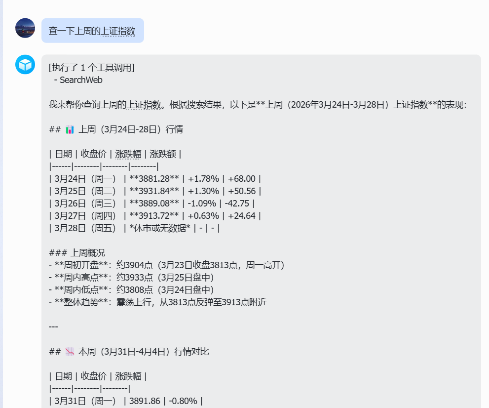
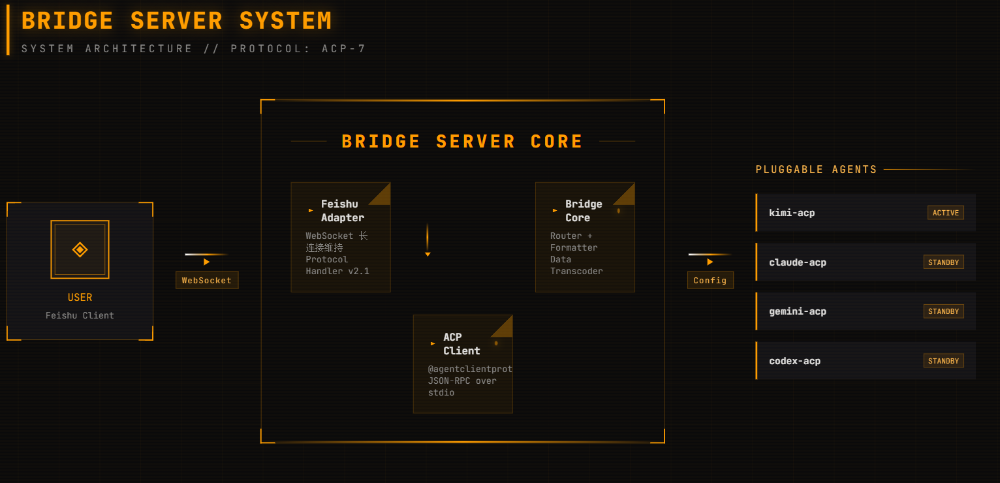

# 🌉 Lark-ACP

<p align="center">
  
  <a href="https://github.com/yancy-coder/lark-acp/blob/main/LICENSE">
    
  </a>
  <a href="https://www.typescriptlang.org/">
    
  </a>
  <a href="https://pnpm.io/">
    
  </a>
  <a href="https://open.feishu.cn/">
    
  </a>
</p>

<p align="center">
  <b>可插拔的飞书(Feishu)与 ACP 兼容 CLI Agent 桥接器</b>
</p>

<p align="center">
  <a href="#-简介">简介</a> •
  <a href="#-功能特性">功能特性</a> •
  <a href="#-效果展示">效果展示</a> •
  <a href="#-系统架构">系统架构</a> •
  <a href="#-快速开始">快速开始</a> •
  <a href="#-配置说明">配置说明</a> •
  <a href="#-使用方法">使用方法</a> •
  <a href="#-协议说明">协议说明</a>
</p>

---

## 📖 简介

**Lark-ACP** 是一个可插拔的桥接服务，将 **飞书(Feishu/Lark)** 与支持 **Agent Client Protocol (ACP)** 的 CLI Agent 连接起来。

通过 Lark-ACP，你可以直接在飞书聊天中与各种 AI Agent（如 Kimi、Claude、Gemini、Codex 等）进行交互，无需公网 IP，无需配置 Webhook，即开即用。

### ✨ 为什么选择 Lark-ACP？

- 🔌 **零配置部署** - WebSocket 长连接，无需公网 IP 或域名
- 🤖 **多 Agent 支持** - 支持 Kimi、Claude、Gemini、Codex 等主流 AI Agent
- ⚡ **实时响应** - 流式消息处理，即时反馈
- 🛡️ **安全可靠** - 自动权限管理，适用于个人和团队环境

---

## 🎯 功能特性

- [x] 🔌 **可插拔架构** - 支持多个 ACP 兼容的 CLI Agent，可随时切换
- [x] 🚀 **WebSocket 长连接** - 无需公网 IP，通过 WebSocket 实时接收消息
- [x] 🛡️ **自动权限处理** - 自动批准工具调用权限请求（适用于个人/可信环境）
- [x] 📝 **消息格式化** - 自动将 Agent 响应格式化为飞书兼容的格式
- [x] 🔄 **会话管理** - 支持重置会话、切换 Agent 等操作
- [x] 📊 **工具调用追踪** - 实时显示 Agent 调用的工具及其状态
- [x] 💬 **群聊支持** - 支持在飞书群聊中@机器人进行对话
- [x] 🎛️ **动态切换** - 运行时切换不同的 AI Agent，无需重启服务

---

## 📸 效果展示

<p align="center">
  
</p>

<p align="center">
  <i>在飞书单聊中与 Kimi Agent 对话，实时获取股票行情数据</i>
</p>

### 支持的消息类型

| 类型 | 支持情况 | 说明 |
|------|---------|------|
| 文本消息 | ✅ 已支持 | 普通文本对话 |
| 群聊@ | ✅ 已支持 | 群组中@机器人 |
| 富文本 | ⏳ 计划中 | Markdown 格式化输出 |

---

## 🏗️ 系统架构

<p align="center">
  
</p>

### 架构组件说明

| 组件 | 职责 | 技术实现 |
|------|------|----------|
| **Feishu Adapter** | 飞书消息收发 | WebSocket 长连接，事件订阅 |
| **Bridge Core** | 消息路由与处理 | 核心调度器，格式化输出 |
| **ACP Client** | Agent 通信 | JSON-RPC over stdio |
| **Agent Registry** | Agent 管理 | 动态加载与生命周期管理 |

### 数据流向

```
┌─────────────┐      WebSocket       ┌─────────────────────────────────────┐
│   用户      │ ◄──────────────────► │         Bridge Server Core          │
│ 飞书客户端   │                      │  ┌──────────┐      ┌──────────┐    │
└─────────────┘                      │  │ Feishu   │◄────►│  Bridge  │    │
                                     │  │ Adapter  │      │  Core    │    │
                                     │  └────┬─────┘      └────┬─────┘    │
                                     │       │                 │          │
                                     │  ┌────▼─────────────────▼─────┐    │
                                     │  │      ACP Client            │    │
                                     │  │  (JSON-RPC over stdio)     │    │
                                     │  └────┬───────────────────────┘    │
                                     └───────┼────────────────────────────┘
                                             │
                    ┌────────────────────────┼────────────────────────┐
                    ▼                        ▼                        ▼
             ┌─────────────┐          ┌─────────────┐          ┌─────────────┐
             │   kimi-acp  │          │  claude-acp │          │  gemini-acp │
             │   (Active)  │          │  (Standby)  │          │  (Standby)  │
             └─────────────┘          └─────────────┘          └─────────────┘
```

---

## 🚀 快速开始

### 环境要求

| 依赖 | 版本要求 |
|------|----------|
| Node.js | >= 18.0.0 |
| pnpm | >= 8.0.0 |
| 操作系统 | Windows / macOS / Linux |

### 1️⃣ 克隆项目

```bash
git clone https://github.com/yancy-coder/lark-acp.git
cd lark-acp
```

### 2️⃣ 安装依赖

```bash
pnpm install
```

### 3️⃣ 创建飞书应用

1. 访问 [飞书开放平台](https://open.feishu.cn/app) 创建企业自建应用
2. 在**凭证与基础信息**中获取 **App ID** 和 **App Secret**
3. 在**权限管理**中申请以下权限：
   - `im:message:send`
   - `im:message:receive`
   - `im:chat:readonly`
4. 在**事件订阅**中订阅事件：`im.message.receive_v1`
5. 在**机器人**标签页中启用机器人
6. 发布应用（开发环境可跳过审核）

### 4️⃣ 配置环境变量

```bash
cp .env.example .env
```

编辑 `.env` 文件，填入你的飞书应用凭证：

```env
# Feishu / Lark app credentials (from https://open.feishu.cn/app)
FEISHU_APP_ID=cli_xxxxxxxxxxxxxxxx
FEISHU_APP_SECRET=xxxxxxxxxxxxxxxxxxxxxxxxxxxxxxxx
```

### 5️⃣ 配置 Agents

编辑 `agents.config.json`，配置你要使用的 AI Agent：

```json
{
  "activeAgent": "kimi",
  "workingDirectory": ".",
  "agents": {
    "kimi": {
      "name": "Kimi Code CLI",
      "command": "kimi",
      "args": ["acp"],
      "env": {}
    },
    "claude": {
      "name": "Claude Code",
      "command": "claude",
      "args": ["--acp"],
      "env": {}
    }
  }
}
```

### 6️⃣ 启动服务

**开发模式（热重载）：**

```bash
pnpm dev
```

**生产模式：**

```bash
pnpm build
pnpm start
```

启动成功后，你会看到：

```
[Bridge] Starting Feishu-ACP Bridge...
[ACP] Connected to Kimi Code CLI (protocol v2025-03-31)
[ACP] Session created: xxxxxxxx-xxxx-xxxx-xxxx-xxxxxxxxxxxx
[Feishu] WebSocket connected
[Bridge] Ready — send a message in Feishu to get started
```

---

## ⚙️ 配置说明

### 环境变量

| 变量名 | 必填 | 描述 | 示例 |
|--------|------|------|------|
| `FEISHU_APP_ID` | ✅ | 飞书应用的 App ID | `cli_a9bd492825f8dbcc` |
| `FEISHU_APP_SECRET` | ✅ | 飞书应用的 App Secret | `yFb164CI943lMqcuVkNf6gy...` |

### agents.config.json 配置项

| 字段 | 类型 | 必填 | 描述 |
|------|------|------|------|
| `activeAgent` | string | ✅ | 默认启动的 Agent ID，必须是 `agents` 中的 key |
| `workingDirectory` | string | ❌ | Agent 工作目录，默认为当前目录 `.` |
| `agents` | object | ✅ | Agent 配置字典，key 为 Agent ID |

#### Agent 配置详情

```typescript
interface AgentConfig {
  name: string;           // Agent 显示名称
  command: string;        // 启动命令（需在 PATH 中）
  args: string[];         // 启动参数
  env: Record<string, string>;  // 额外环境变量
}
```

**示例配置：**

```json
{
  "kimi": {
    "name": "Kimi Code CLI",
    "command": "kimi",
    "args": ["acp"],
    "env": {
      "KIMI_API_KEY": "sk-..."
    }
  }
}
```

---

## 🎮 使用方法

### 基本对话

在飞书中直接向机器人发送消息即可开始对话：

```
你好，帮我写一个快速排序的 Python 实现
```

### 命令列表

| 命令 | 功能 | 示例 |
|------|------|------|
| `/switch <agent>` | 切换到指定 Agent | `/switch claude` |
| `/reset` | 重置当前会话（清空上下文） | `/reset` |
| `/status` | 查看当前状态和配置 | `/status` |
| `/help` | 显示帮助信息 | `/help` |

### 群聊使用

在群聊中@机器人并发送消息：

```
@机器人 帮我总结这份文档的要点
```

机器人会自动去除@标记，只处理实际消息内容。

### 切换 Agent 示例

```
/switch claude
```

输出：
```
🔄 正在切换到 claude...
✅ 已切换到 Claude Code
```

### 查看状态

```
/status
```

输出：
```
📊 当前状态
Agent: Kimi Code CLI
Agent ID: kimi
工作目录: D:\projects\my-project
```

---

## 📡 协议说明

### ACP (Agent Client Protocol)

Lark-ACP 实现了 ACP 协议的客户端，通过以下方式与 Agent 通信：

- **传输层**: stdio (标准输入输出)
- **协议格式**: JSON-RPC 2.0
- **消息编码**: NDJSON (Newline Delimited JSON)

### 支持的 ACP 方法

| 方法 | 说明 |
|------|------|
| `initialize` | 初始化连接，交换协议版本和能力 |
| `session/new` | 创建新会话 |
| `session/prompt` | 发送提示并获取响应 |
| `session/permission` | 处理权限请求（自动批准） |

### 飞书事件

| 事件类型 | 说明 |
|----------|------|
| `im.message.receive_v1` | 接收私聊/群聊消息 |

---

## 🤖 支持 Agents

Lark-ACP 支持任何兼容 [Agent Client Protocol](https://github.com/AgentClientProtocol) 的 CLI Agent：

| Agent | 命令 | 版本要求 | 状态 |
|-------|------|----------|------|
| [Kimi Code CLI](https://www.moonshot.cn/) | `kimi acp` | >= 1.0.0 | ✅ 已验证 |
| [Claude Code](https://claude.ai/) | `claude --acp` | >= 0.1.0 | ✅ 已验证 |
| [Gemini CLI](https://deepmind.google/technologies/gemini/) | `gemini --acp` | - | ⏳ 待验证 |
| [Codex CLI](https://openai.com/) | `codex-acp` | - | ⏳ 待验证 |

### 添加自定义 Agent

在 `agents.config.json` 中添加新的 Agent 配置即可：

```json
{
  "agents": {
    "my-agent": {
      "name": "My Custom Agent",
      "command": "my-agent-cli",
      "args": ["--acp-mode"],
      "env": {}
    }
  }
}
```

---

## 📁 项目结构

```
lark-acp/
├── src/
│   ├── index.ts              # 入口文件
│   ├── bridge.ts             # 桥接核心（消息调度）
│   ├── config.ts             # 配置加载与验证
│   ├── feishu/
│   │   ├── adapter.ts        # 飞书 WebSocket 适配器
│   │   └── formatter.ts      # 消息格式化工具
│   └── acp/
│       ├── client.ts         # ACP 协议客户端
│       └── registry.ts       # Agent 注册表
├── .env.example              # 环境变量模板
├── agents.config.json        # Agent 配置文件
├── package.json              # 项目依赖
├── tsconfig.json             # TypeScript 配置
├── LICENSE                   # MIT 许可证
└── README.md                 # 本文档
```

---

## 🔒 安全提示

> ⚠️ **重要提示**
> 
> 本项目默认**自动批准所有权限请求**（`allow_always`），这意味着 Agent 可以：
> - 读取本地文件
> - 执行系统命令
> - 访问网络资源
> 
> 这适用于**个人或可信环境**。在以下场景请谨慎使用：
> - 生产服务器
> - 多人共享环境
> - 处理敏感数据的场景

---

## 🐛 故障排除

### 常见问题

#### Q: 启动时提示 "Missing FEISHU_APP_ID or FEISHU_APP_SECRET"

**A:** 请检查 `.env` 文件是否存在，并且包含正确的凭证信息。

#### Q: WebSocket 连接成功但收不到消息

**A:** 请检查飞书应用的事件订阅配置：
1. 确认已订阅 `im.message.receive_v1` 事件
2. 确认机器人已添加到聊天会话中
3. 检查应用是否已发布（或开启调试模式）

#### Q: Agent 切换失败

**A:** 请检查：
1. Agent 命令是否在 PATH 中可用（`which <command>` 或 `where <command>`）
2. `agents.config.json` 配置是否正确
3. Agent 是否支持 ACP 协议

#### Q: 消息发送失败

**A:** 请检查飞书应用权限：
- 确认已申请 `im:message:send` 权限
- 确认机器人有权限向该会话发送消息

---

## 🤝 贡献指南

欢迎提交 Issue 和 PR！

1. Fork 本仓库
2. 创建你的特性分支 (`git checkout -b feature/AmazingFeature`)
3. 提交更改 (`git commit -m 'Add some AmazingFeature'`)
4. 推送到分支 (`git push origin feature/AmazingFeature`)
5. 打开 Pull Request

---

## 📄 许可证

[MIT](LICENSE) © 2026

---

## 🙏 致谢

- [Feishu OpenAPI](https://open.feishu.cn/) - 飞书开放平台
- [Agent Client Protocol](https://github.com/AgentClientProtocol) - ACP 协议规范
- [TypeScript](https://www.typescriptlang.org/) - 编程语言
- [Moonshot AI](https://www.moonshot.cn/) - Kimi
- [Anthropic](https://claude.ai/) - Claude

---

<p align="center">
  <b>如果这个项目对你有帮助，请给个 ⭐ Star！</b>
</p>
